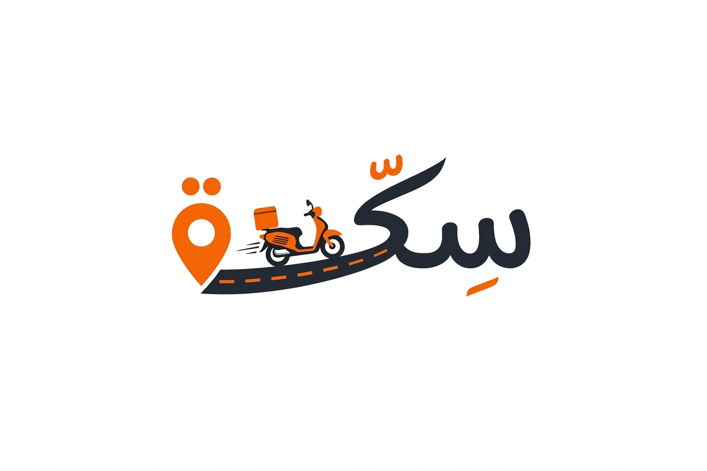

<div align="center">



# سِكّة — Sekka Landing Page

### شريك شغلك في الديليفري
*Your Delivery Work Partner*

[](https://developer.mozilla.org/en-US/docs/Web/HTML)
[](https://tailwindcss.com/)
[](https://developer.mozilla.org/en-US/docs/Web/JavaScript)
[](https://jquery.com/)

[](#-internationalization)
[](#-theme-system)
[](#)
[](#)

**Landing page احترافية لتطبيق سِكّة — تطبيق إدارة مهام الديليفري الذكي لسائقي التوصيل في مصر**

[🌐 Preview](#-preview) • [⚡ Features](#-features) • [🎨 Brand](#-brand-identity) • [🚀 Setup](#-getting-started) • [📬 Contact](#-contact)

</div>

---

## 📑 جدول المحتويات — Table of Contents

- [📖 نظرة عامة — Overview](#-نظرة-عامة--overview)
- [🌐 Preview](#-preview)
- [⚡ المميزات — Features](#-المميزات--features)
- [🎨 الهوية البصرية — Brand Identity](#-الهوية-البصرية--brand-identity)
- [🛠️ التقنيات — Tech Stack](#️-التقنيات--tech-stack)
- [📁 هيكل المشروع — Project Structure](#-هيكل-المشروع--project-structure)
- [🚀 البدء — Getting Started](#-البدء--getting-started)
- [🌍 تبديل اللغة — Internationalization](#-تبديل-اللغة--internationalization)
- [🌓 الوضع الداكن — Theme System](#-الوضع-الداكن--theme-system)
- [🎬 الـ Animations](#-الـ-animations)
- [📱 التصميم المتجاوب — Responsive Design](#-التصميم-المتجاوب--responsive-design)
- [♿ Accessibility](#-accessibility)
- [🧪 Browser Support](#-browser-support)
- [🗺️ Roadmap](#️-roadmap)
- [🤝 المساهمة — Contributing](#-المساهمة--contributing)
- [📜 License](#-license)
- [🙏 Credits](#-credits)
- [📬 Contact](#-contact)

---

## 📖 نظرة عامة — Overview

**سِكّة (Sekka)** تطبيق موبايل مصري يساعد سائقي التوصيل على إدارة يومهم بذكاء — من تنظيم الطلبات وتحسين المسارات إلى المحاسبة الدقيقة والحماية من النصب.

هذا الـ **Repository** يحتوي على **صفحة الهبوط الرسمية (Landing Page)** المصممة لعرض التطبيق بشكل احترافي، مع التركيز على الهوية البصرية القوية، التفاعلات السلسة، والأنيميشن الجذاب.

> *Sekka is an Egyptian mobile app that helps delivery drivers manage their day smartly — from organizing orders and optimizing routes to accurate accounting and fraud protection. This repository contains the **official Landing Page** for the app.*

### ✨ الأهداف

- 🎯 **تعريف السوق بالتطبيق** وفوائده للسائق المصري
- 📲 **تحفيز التحميل** من Google Play و App Store
- 🎨 **عرض الهوية البصرية** بشكل احترافي وجذاب
- ⚡ **تجربة مستخدم سريعة** بدون اعتماد على أي framework ثقيل

---

## 🌐 Preview

<div align="center">

| Light Mode (Arabic — RTL) | Dark Mode (English — LTR) |
|:---:|:---:|
| 🌞 عربي + RTL | 🌙 English + LTR |
| خط Tajawal | خط Inter |

</div>

> 💡 **Tip:** افتح `index.html` في المتصفح لتشاهد الصفحة بتفاعلاتها الكاملة. أو استخدم GitHub Pages (راجع [Getting Started](#-البدء--getting-started)).

---

## ⚡ المميزات — Features

<div align="center">

| 🌍 | 🎨 | 🚀 |
|:---:|:---:|:---:|
| **Bilingual** | **Modern UI** | **Smooth Animations** |
| AR ↔ EN مع RTL/LTR | هوية قوية بالألوان الرسمية | بدون أي framework |

</div>

### 🎨 تجربة بصرية كاملة

- ✅ **Bilingual Support:** عربي (RTL) + إنجليزي (LTR) بتبديل فوري وسلس
- ✅ **Dark Mode:** وضع داكن مع حفظ التفضيل في `localStorage`
- ✅ **Font Smart Switch:** Tajawal للعربي + Inter للإنجليزي تلقائياً
- ✅ **Responsive Design:** يشتغل على الموبايل، التابلت، والديسكتوب

### ⚡ أنيميشن احترافي

- 🎭 **Scroll Reveal:** عناصر تظهر تدريجياً عند الـ scroll
- 🌀 **3D Phone Tilt:** الموبايل mockup يتحرك مع الماوس في 3D
- ⌨️ **Typewriter Effect:** نصوص تتكتب تلقائياً
- 📈 **Animated Counters:** أرقام تعدّ عند الظهور
- 🛵 **SVG Road Animation:** سكوتر يتحرك على طريق (يعكس اللوجو)
- 🎨 **Gradient Text:** عناوين بـ gradient متحرك
- 💫 **Parallax Blobs:** أشكال عضوية تتحرك مع الماوس
- 🖱️ **Cursor Follower:** مؤشر مخصص (Desktop only)
- 📊 **Scroll Progress Bar:** شريط تقدم بـ gradient برتقالي

### 🧩 الأقسام (Sections)

| # | القسم | الوصف |
|---|-------|--------|
| 1 | **Navbar** | Sticky + glassmorphism + language/theme toggles |
| 2 | **Hero** | 3D phone mockup + store badges + typewriter |
| 3 | **Problem vs Solution** | مقارنة قبل/بعد سكّة |
| 4 | **Features Grid** | 8 مميزات رئيسية بأيقونات Iconsax |
| 5 | **How It Works** | 3 خطوات timeline |
| 6 | **Stats** | 4 أرقام متحركة على gradient برتقالي |
| 7 | **Testimonials** | 3 آراء سائقين |
| 8 | **Download CTA** | Google Play + App Store + QR-ready |
| 9 | **Footer** | About + links + contact + social |
| 10 | **Sticky Mobile Download** | شريط تحميل ثابت للموبايل |

---

## 🎨 الهوية البصرية — Brand Identity

### 🎨 Color Palette

<div align="center">

| Color | Hex | Usage |
|:-----:|:---:|-------|
|  **Primary** | `#FC5D01` | Buttons, links, interactive elements |
|  **Primary Light** | `#FFF0E6` | Secondary backgrounds |
|  **Primary Dark** | `#D94E00` | Pressed states |
|  **Gradient End** | `#FF8534` | Gradients |
|  **Navy** | `#2D3748` | Logo secondary color |
|  **Background** | `#F7FAFC` | Light mode background |
|  **Headline** | `#1A202C` | Primary text |
|  **Body** | `#4A5568` | Body text |

</div>

### 🎨 Gradient

```css
background: linear-gradient(135deg, #FC5D01 0%, #FF8534 100%);
```

### ✍️ Typography

| Language | Font | Weights |
|----------|------|---------|
| **العربية** | [Tajawal](https://fonts.google.com/specimen/Tajawal) | 300 / 400 / 500 / 700 / 900 |
| **English** | [Inter](https://fonts.google.com/specimen/Inter) | 300 / 400 / 500 / 700 / 900 |

### 🎯 Border Radius

```
Buttons:      12px
Cards:        16px
Input Fields: 12px
Pills/Chips:  100px (full)
```

---

## 🛠️ التقنيات — Tech Stack

<div align="center">

| التقنية | الدور | المصدر |
|---------|-------|--------|
| [HTML5](https://developer.mozilla.org/en-US/docs/Web/HTML) | البنية الأساسية | — |
| [Tailwind CSS](https://tailwindcss.com/) | التنسيق | CDN (Play CDN) |
| [Vanilla JavaScript](https://developer.mozilla.org/en-US/docs/Web/JavaScript) | التفاعلات والـ animations | — |
| [jQuery](https://jquery.com/) | Smooth scroll + counters | CDN |
| Inline SVG Icons | أيقونات بستايل Iconsax (نفس عائلة التطبيق) | Inline |
| [Google Fonts](https://fonts.google.com/) | Tajawal + Inter | CDN |

</div>

> 🚫 **مفيش أي Framework** — React/Vue/Angular **غير مستخدم**. كل شيء vanilla.

---

## 📁 هيكل المشروع — Project Structure

```
Sekka-Landing-Page/
│
├── 📄 index.html              # الصفحة الرئيسية (10 أقسام + i18n attributes)
│
├── 📁 css/
│   └── 🎨 style.css           # Animations + keyframes + dark mode
│
├── 📁 js/
│   ├── ⚡ main.js             # Scroll reveals + tilt + counters + nav
│   ├── 🌐 i18n.js             # AR/EN translations + RTL/LTR switch
│   └── 🌓 theme.js            # Dark mode toggle + persistence
│
├── 📁 assets/
│   └── 🖼️ logo.png            # لوجو التطبيق الرسمي
│
├── 📄 README.md               # هذا الملف
├── 📄 .gitignore              # استثناءات Git
└── 📄 LICENSE                 # (اختياري)
```

### 📊 File Sizes (تقريبية)

| File | Lines | Size |
|------|-------|------|
| `index.html` | ~940 | ~56 KB |
| `css/style.css` | ~910 | ~24 KB |
| `js/main.js` | ~300 | ~11 KB |
| `js/i18n.js` | ~420 | ~18 KB |
| `js/theme.js` | ~60 | ~2 KB |

---

## 🚀 البدء — Getting Started

### 📋 Prerequisites

- متصفح حديث (Chrome 90+, Firefox 88+, Safari 14+, Edge 90+)
- اتصال إنترنت (للـ CDN الخاصة بـ Tailwind, jQuery, Fonts)

### ⚡ تشغيل الموقع محلياً

#### الخيار 1: فتح مباشر

```bash
# فقط افتح index.html في المتصفح
# على Windows:
start index.html

# على macOS:
open index.html

# على Linux:
xdg-open index.html
```

#### الخيار 2: Local Server (موصى به)

```bash
# باستخدام Python
python -m http.server 8000

# باستخدام Node.js (npx)
npx serve .

# باستخدام PHP
php -S localhost:8000
```

ثم افتح في المتصفح: `http://localhost:8000`

#### الخيار 3: GitHub Pages (للنشر)

1. اذهب لـ **Settings** في الريبو
2. اختر **Pages** من القائمة الجانبية
3. تحت **Source**، اختر `main` branch و `/ (root)` folder
4. احفظ — الموقع هيكون متاح على:
   ```
   https://<username>.github.io/Sekka_Landing_Page/
   ```

### 🔧 تخصيص الموقع

#### تعديل اللوجو
```
استبدل: assets/logo.png
```

#### إضافة روابط المتجر الحقيقية
في `index.html`، ابحث عن `href="#"` بجوار أيقونات Google Play و App Store وضع الروابط الفعلية.

#### تعديل الترجمات
في `js/i18n.js`، عدّل الـ `translations` object:
```js
const translations = {
  ar: { "hero.title1": "شريك شغلك", ... },
  en: { "hero.title1": "Your Work Partner", ... }
};
```

#### تغيير الألوان
في `index.html` داخل `tailwind.config`، عدّل `colors.primary`.
في `css/style.css`، عدّل CSS variables في `:root`.

---

## 🌍 تبديل اللغة — Internationalization

النظام مبني على `data-i18n` attributes:

```html
<h1 data-i18n="hero.title1">شريك شغلك</h1>
```

وفي `js/i18n.js`:

```js
const translations = {
  ar: { "hero.title1": "شريك شغلك" },
  en: { "hero.title1": "Your work partner" }
};
```

### 🔁 التبديل

- بضغطة على زر **AR | EN** في الـ Navbar
- يُحدّث تلقائياً:
  - ✅ `<html lang>` و `<html dir>` (rtl/ltr)
  - ✅ الخط (Tajawal ↔ Inter)
  - ✅ كل النصوص في الصفحة
  - ✅ يحفظ الاختيار في `localStorage`

### ➕ إضافة لغة جديدة

```js
// 1. أضف الترجمات
translations.fr = {
  "hero.title1": "Votre partenaire de livraison",
  // ...
};

// 2. أضف زر التبديل في HTML
<span data-lang-switch="fr">FR</span>
```

---

## 🌓 الوضع الداكن — Theme System

- 🌞 **Light Mode** (افتراضي)
- 🌙 **Dark Mode** مع ألوان Brand Identity الرسمية
- 💾 **Persistence** في `localStorage`
- 🎨 **Auto-detect** لـ `prefers-color-scheme` عند أول زيارة
- ✨ **Smooth transition** 400ms بين الوضعين

### Dark Mode Colors

| Element | Light | Dark |
|---------|-------|------|
| Background | `#F7FAFC` | `#121212` |
| Surface | `#FFFFFF` | `#1E1E1E` |
| Border | `#E2E8F0` | `#2D3748` |
| Headline | `#1A202C` | `#F7FAFC` |
| Body | `#4A5568` | `#A0AEC0` |

> **ملاحظة:** الألوان الأساسية (Primary, Success, Error) ثابتة في الوضعين — عشان الهوية.

---

## 🎬 الـ Animations

### 📜 Animation List

| # | Animation | Trigger | Duration |
|---|-----------|---------|----------|
| 1 | Scroll Reveal (up/left/right/scale) | IntersectionObserver | 800ms |
| 2 | Counter Animation | On visible | 1800ms |
| 3 | Typewriter | On load | Loop |
| 4 | 3D Phone Tilt | Mouse move | 300ms |
| 5 | Floating Badges | CSS loop | 5s |
| 6 | Pulse Glow | CSS loop | 3s |
| 7 | Blob Morph | CSS loop | 20s |
| 8 | Gradient Shift | CSS loop | 4s |
| 9 | Road Draw | CSS on load | 4s |
| 10 | Scooter Ride | SMIL animateMotion | 7s |
| 11 | Feature Card Tilt | Mouse move | 400ms |
| 12 | Cursor Follower | Mouse move | 150ms |
| 13 | Parallax Blobs | Mouse move | — |
| 14 | Navbar Scroll | Scroll > 40px | 300ms |
| 15 | Mobile Drawer Slide | Click | 400ms |

### ⚡ Performance

- ✅ استخدام `IntersectionObserver` بدل `scroll` events
- ✅ `requestAnimationFrame` للـ smooth animations
- ✅ `will-change` بحذر
- ✅ `prefers-reduced-motion` respect كامل
- ✅ Hardware-accelerated transforms (`translateZ`, `translate3d`)

---

## 📱 التصميم المتجاوب — Responsive Design

| Breakpoint | Width | Layout |
|------------|-------|--------|
| 📱 Mobile | `< 640px` | Stack + hamburger menu |
| 📱 Mobile L | `640–768px` | Tighter spacing |
| 💻 Tablet | `768–1024px` | 2-column grids |
| 🖥️ Desktop | `1024–1280px` | Full layout |
| 🖥️ Desktop XL | `> 1280px` | Wide content max 1280px |

### 📐 Tested On

- ✅ iPhone 14 Pro (390 × 844)
- ✅ iPhone SE (375 × 667)
- ✅ iPad (768 × 1024)
- ✅ MacBook 13" (1280 × 800)
- ✅ Desktop FHD (1920 × 1080)
- ✅ Desktop 4K (3840 × 2160)

---

## ♿ Accessibility

- ✅ Semantic HTML5 (`<nav>`, `<section>`, `<article>`, etc.)
- ✅ `aria-label` لكل الأزرار الأيقونية
- ✅ `alt` attributes للصور
- ✅ Keyboard navigation
- ✅ Focus indicators visible
- ✅ Color contrast (WCAG AA)
- ✅ `prefers-reduced-motion` respect
- ✅ `lang` و `dir` attributes تتحدث مع تغيير اللغة

---

## 🧪 Browser Support

| Browser | Version | Status |
|---------|---------|--------|
| Chrome | 90+ | ✅ Fully Supported |
| Firefox | 88+ | ✅ Fully Supported |
| Safari | 14+ | ✅ Fully Supported |
| Edge | 90+ | ✅ Fully Supported |
| Opera | 76+ | ✅ Fully Supported |
| Samsung Internet | 14+ | ✅ Fully Supported |
| IE 11 | — | ❌ Not Supported |

---

## 🗺️ Roadmap

- [x] ✅ Landing Page v1.0 (Bilingual + Dark Mode)
- [x] ✅ Iconsax Icons Integration
- [x] ✅ GitHub Repository
- [ ] 🚀 إضافة روابط Google Play + App Store الفعلية
- [ ] 🚀 GitHub Pages deployment
- [ ] 📱 Screenshots حقيقية من التطبيق
- [ ] 🎥 Demo video في الـ Hero
- [ ] 🗺️ Interactive map preview section
- [ ] 💬 Live chat / Contact form
- [ ] 📊 Google Analytics integration
- [ ] 🔍 SEO optimization (meta tags, sitemap, robots.txt)
- [ ] 📄 Privacy Policy + Terms pages
- [ ] 🌐 إضافة لغات إضافية (French, Arabic dialects)

---

## 🤝 المساهمة — Contributing

نرحب بأي مساهمة! 🎉

1. Fork الـ repository
2. أنشئ branch جديد: `git checkout -b feature/AmazingFeature`
3. اعمل commit لتغييراتك: `git commit -m 'Add some AmazingFeature'`
4. ادفع الـ branch: `git push origin feature/AmazingFeature`
5. افتح Pull Request

### 📏 Coding Standards

- HTML: 2-space indentation، semantic tags
- CSS: BEM-like naming للـ custom classes
- JS: ES6+، camelCase، JSDoc للدوال المعقدة
- Commit messages: Conventional Commits
  - `feat: add new feature`
  - `fix: fix bug`
  - `docs: update documentation`
  - `style: formatting changes`
  - `refactor: code refactoring`

---

## 📜 License

هذا المشروع هو ملك لفريق **سِكّة**. جميع الحقوق محفوظة.

*This project is owned by the **Sekka** team. All rights reserved.*

للاستفسار عن الترخيص للاستخدام: [support@sekka.app](mailto:support@sekka.app)

---

## 🙏 Credits

### 🎨 الهوية البصرية
- **Design System:** فريق سِكّة
- **Logo:** فريق سِكّة

### 🔤 الخطوط
- **[Tajawal](https://fonts.google.com/specimen/Tajawal)** by Boutros International
- **[Inter](https://fonts.google.com/specimen/Inter)** by Rasmus Andersson

### 🎯 الأيقونات
- **[Iconsax](https://iconsax.io/)** by VuesaxLab — أسلوب الأيقونات Linear/Bold
- **Inline SVG** — مكتوبة يدوياً بستايل Iconsax لضمان عدم وجود dependencies

### 🛠️ المكتبات
- **[Tailwind CSS](https://tailwindcss.com/)**
- **[jQuery](https://jquery.com/)**

---

## 📬 Contact

<div align="center">

**فريق سِكّة — Sekka Team**

📧 **Email:** [support@sekka.app](mailto:support@sekka.app)
📱 **Phone:** 01000000000
📍 **Location:** القاهرة، مصر — Cairo, Egypt

[](#)
[](#)
[](#)
[](#)

---

<sub>**© 2026 سِكّة — جميع الحقوق محفوظة**</sub>

<sub>صُنع بـ ❤️ في مصر — *Made with ❤️ in Egypt*</sub>

</div>
